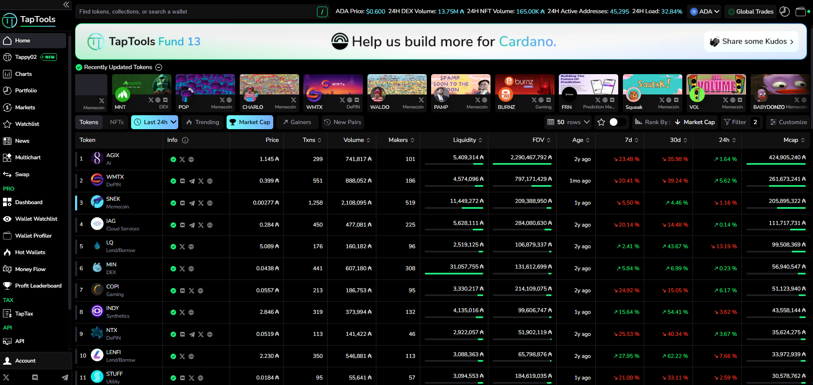

#                                                                                   Protoqit_CRM
## Welcome! 👋
This project is a data-analyses website for [(Taptools.io)](https://www.taptools.io/),(USA),
I developed a big portion of the backend api for this website 👨‍💻.

### Built with:
<ul>
<li>Restful Api</li>
<li>Flask</li>
<li class="has-line-data" data-line-start="18" data-line-end="19">MySql</li>
<li class="has-line-data" data-line-start="18" data-line-end="19">PostgreSQL</li>
<li class="has-line-data" data-line-start="18" data-line-end="19">Socket.io</li>
<li class="has-line-data" data-line-start="18" data-line-end="19">Redis</li>
<li class="has-line-data" data-line-start="18" data-line-end="19">Celery</li>
<li class="has-line-data" data-line-start="18" data-line-end="19">SqlAlchemy</li>
<li class="has-line-data" data-line-start="19" data-line-end="20">jsonwebtoken (JWT)</li>
<li class="has-line-data" data-line-start="21" data-line-end="18">AWS s3</li>
<li class="has-line-data" data-line-start="22" data-line-end="19">AWS EC2</li>
<li class="has-line-data" data-line-start="23" data-line-end="20">Nginx</li>
<li class="has-line-data" data-line-start="24" data-line-end="21">Swagger</li>
<li class="has-line-data" data-line-start="25" data-line-end="22">Docker</li>
</ul>

### Some of the site features (Site is expanding by the minute so this is not all the features ofcourse):
#### Data Analyses 
#### Market Overview 
#### Portfolio 
#### Taptax (Taxation tool for your crypto investments) 
#### Open api (Reliable blockchain data) 

### Swagger:

### Project folders structure:

### Source code is privet because is ownered to Taptools.io 🤷‍♂️.
#### But you can contact me if you want to inquire about something.
## Author
- LinkedIn - [@yahiaabdelati](https://www.linkedin.com/in/yahiaabdelati/)